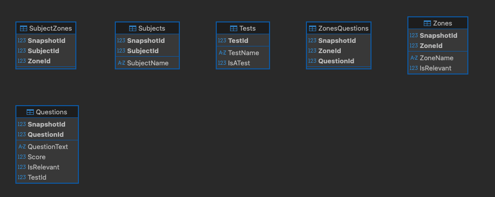

# GradesService

This service runs a snapshot-based grading system. It models subjects, their zones (sub-topics), the questions that assess them, and the tests those questions belong to. Each student assessment creates a new snapshot (snapshot 0 is the catalog/template), duplicating the links so results can be tracked over time.

## What this service contains?
### SQL Assets

- simple_migration_script.sql: static data migration.

- data_generator.sql: data generator procedure.

- calculate_score_per_snapshot.sql: scoring procedure (per subject, national vs non-national).

### Backend (ASP.NET Core + EF Core)

- Questions CRUD (snapshot-scoped) with pagination and validation.

- Student Report endpoint (single snapshot).

- Principal Report endpoint (multi-snapshot).

### Schema layout

## Getting Started

### Prerequisites

- .NET 9 SDK (`dotnet --info` to verify)
- SQL Server (local/remote/Azure). For macOS, use a remote SQL Server or Azure SQL.
- (Optional) Docker + Docker Compose for containerized run

### Run the Server
- Local dev run: `dotnet watch run --project src/Grades.Api --reload`
- Via docker compose: `docker compose up`.
- Swagger: `http://localhost:8080/swagger/index.html`

## Implementation Notes

### Project Structure

- **Grades.Domain** – Entities.
- **Grades.Application** – DTOs, interfaces (ports), validation, exceptions.
- **Grades.Infrastructure** – EF Core DbContext.
- **Grades.Api** – Main application, REST API (controllers), Swagger/OpenAPI UI.

> **Inspiration:** Structure inspired by Jason Taylor’s Clean Architecture (ASP.NET Core):
> https://github.com/jasontaylordev/CleanArchitecture

### Tech Stack
- **NET 9 / ASP.NET Core 9** — Web API hosting, routing, and middleware.

- **EF Core 9 + SQL Server + Microsoft.Data.SqlClient** — Querying SQL Server using EF Core (ORM) and LINQ; supports transactions, composite keys, pagination (Skip/Take), and efficient server-side operations.

- **Swashbuckle.AspNetCore**  — OpenAPI/Swagger generation and interactive docs (Swagger UI).

### SQL Scripts
1.  /sql/simple_migration_script.sql
    - Declared constants variable for convenient.
    - Wrap in a transaction for consistency.
    - Manual ID allocation (MAX(id)+1) because tables ID columns aren’t IDENTITY.

2. /sql/calculate_score_per_snapshot.sql
   -  Split the problem into CTEs. `BaseRawScores` for matching scores of questions with the relevant subjects inside the snapshot context. `ZoneAgg`, `SubjectScore`, `SubjectQCounts` for aggregation calculations.
   -  LEFT JOINs in the final SELECT keep empty subjects visible.

### REST API WebServer
1. **Questions CRUD**

- get all questions
  - Added pagination mechanism using `take` and `skip`.

- create question
  - Besides the required fields in the Question schema, I added `ZoneId`. This is crucial for scoring calculations.

- delete question
  - Delete both from the questions table and also from ZonesQuestions table.

2. **Student Report**
  - Catalog (SnapshotId = 0) is not allowed. For a valid snapshot, we compute zone averages (ignoring NULL scores).
3.  **Principal Report**
   - Catalog (SnapshotId 0) is rejected. We aggregate across the provided snapshots and return the single lowest-average zone overall

### Observations
- ID columns are intentionally not IDENTITY. Because each new snapshot duplicates the same entities.
